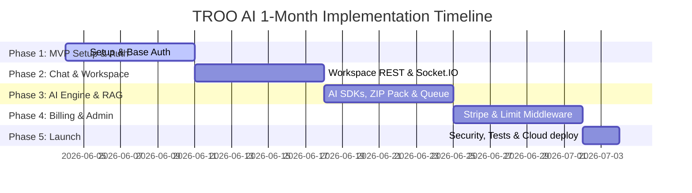

# Project Implementation Plan: TROO AI (1-Month Accelerated Roadmap)

This planning document outlines the consolidated schedule to develop, integrate, and launch both frontend and backend systems for TROO AI within 1 month (30 days), starting **June 4, 2026** and completing by **July 4, 2026**.

| Module / Phase | Duration | Due Date | Core Tasks (Frontend & Backend Integration) |
| :--- | :--- | :--- | :--- |
| **Phase 1: MVP Setup & Authentication Engine** | 7 Days | 11-06-2026 | 1. **Frontend Setup**: Initialize React/Next.js app structure, configure Tailwind CSS, set up basic route protection based on user roles. 2. **Authentication UI**: Build signup, login, password recovery, and Google/GitHub login buttons. 3. **Backend Setup**: Initialize Node.js/Express app, define MongoDB Mongoose models (`User`, `Token`, `Workspace`), configure secure JWT and HttpOnly cookie-based token rotation. 4. **OAuth & Mail Integration**: Set up Google & GitHub OAuth handlers, and integrate Nodemailer/SendGrid for verification emails. 5. **Integration**: Bind frontend login/signup screens to backend auth APIs. |
| **Phase 2: Workspaces, Prompt Audits & Real-Time Chat** | 7 Days | 18-06-2026 | 1. **Frontend UI**: Build the primary Workspace chat panel, message bubbles, generation state loaders, and sidebar navigation. 2. **Workspace APIs**: Develop RESTful endpoints for CRUD operations on workspaces (create, rename, archive, delete). 3. **Real-Time Pipeline**: Configure Socket.IO server to stream generation status updates, logs, and prompt completion states in real-time. 4. **Prompt Checks**: Setup backend validator endpoints to parse and log prompts, verify user credit balances, and compute credit deductions. |
| **Phase 3: AI Generation, RAG & Admin UI** | 7 Days | 25-06-2026 | 1. **Extended Inputs UI**: Create Figma link input fields and image screenshot upload drops using React Dropzone. 2. **Multi-Modal AI Engine**: Integrate OpenAI, Anthropic, and Gemini SDKs to handle text prompts, Figma links (via Figma API), and screenshot analysis. 3. **Code Synthesis & Packaging**: Build the in-memory builder to generate HTML/React/Vue packages, compress them into ZIP archives, and save to AWS S3. 4. **RAG & Queuing**: Configure vector database (Pinecone/Weaviate) file ingestion and establish a Redis-based async execution queue (BullMQ) with automated retries. |
| **Phase 4: Billing Portal, Credits & Reports** | 7 Days | 02-07-2026 | 1. **Pricing UI**: Build subscription plan comparison layouts and user analytics charts showing credit history and download volumes. 2. **Stripe Integration**: Integrate Stripe SDK, build customer portal redirects, and implement robust webhook processors to handle subscription plans (Free, Pro, Agency) and renewals/failures. 3. **Limit Enforcement Middleware**: Implement backend interceptors to block actions when workspace/storage/download quotas are exceeded. 4. **Admin KPIs & Management**: Build administrative APIs and tables for CRUD on users, plan updates, AI configuration switches, and cost logs. |
| **Phase 5: Performance, Security & Launch** | 2 Days | 04-07-2026 | 1. **Frontend Optimization**: Implement code-splitting, lazy loading, image optimizations, and GDPR cookie consent overlays. 2. **Backend Hardening**: Set up Redis caching layer, database index tuning, Helmet.js headers, rate-limiting (Express Rate Limit), and query sanitization. 3. **Automated Testing**: Execute frontend unit tests (Jest/RTL) and backend integration tests (Supertest/Jest) for complete validation. 4. **Production Deployment**: Containerize app using Docker, set up CI/CD pipelines, and deploy backend to AWS ECS/Kubernetes and frontend to CloudFront/Vercel. |

---

## Daily Progression Schedule

